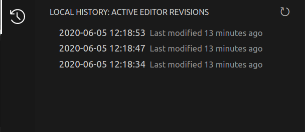
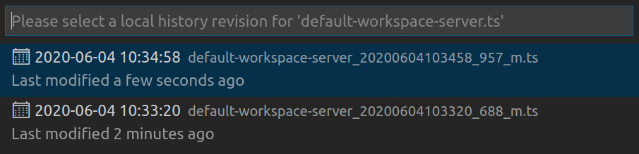
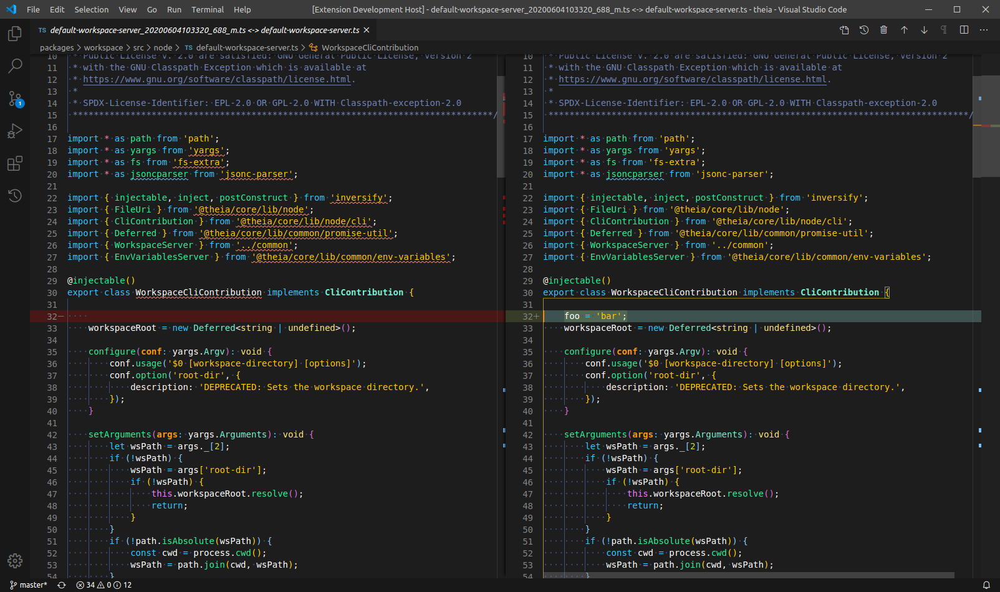
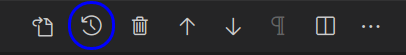
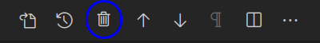
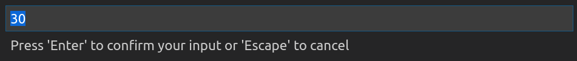

<br />
<div align='center'>


# Local History


</div>


## Description

The **Local History** extension manages local revisions of a file independently of source control providers, and allows users to easily view, track and restore files based on previous saves. The extension automatically creates save backups for the user so they are able to easily recover past revisions which is especially useful for disaster recovery.

## Features

The following are some high-level features the extension provides:

- ### Automatic Revisions

  The extension creates automatic read-only revisions for the user based on when files are saved in their workspace. These automatic revisions are tracked by the extension and users are capable or reviewing them directly in the application. 

- ### View Revisions as a `Diff`

  When reviewing a revision for an active editor, the revision will be displayed as a `diff` (lines added versus deleted) so that users are able to easily view the differences between the revision and the content of the current editor.

- ### Local History View

  The extension contributes a new view to the application which is used to easily view, and manage revisions for the active file. From this view users are able to view available revisions, open them in a diff editor, and remove the revision.

  <div align='center'>

    

  </div>

- ### Revision Management

  The extension includes the capability to perform different management actions.\
  Such actions include:
  - ability to revert to a previous revision
  - ability to clear revisions for an active editor
  - ability to clear all revisions older than a specified time

- ### Simple Storage Structure

  The extension utilizes a simple storage structure (under the user's home `.local-history`) which mimics the folder structure of the workspace project. This allows users to easily navigate the `.local-history` folder outside of the application if they wish to view previous revisions quickly.

## Documentation

---

### Commands

#### `Local History: View History`:

The following command prompts the user to select a revision for the active editor (given that revisions) exist. Upon selecting a revision, a `diff` editor is opened for users to easily view the differences between their revision and the current content of the editor.

The user can first select a revision from the `quick-pick` menu:

<div align='center'>



</div>

Once a selection is made, the `diff` editor is opened where the user can proceed to perform follow-up actions:

<div align='center'>



</div>

#### `Local History: Revert to Previous Revision`:

The command allows users to revert the currently active editor to a previous revision. The command is available when viewing a revision as a `diff`.

<div align='center'>



</div>

#### `Local History: Remove Revision`:

The command allows users to remove the currently opened revision. The command is available when viewing a revision as a `diff`.

<div align='center'>



</div>

#### `Local History: Clear History`:

The command clears the entire history for the active editor.

#### `Local History: Clear Old History`:

The command prompts the user to specify the number of days in which to clear the entire history under `.local-history`.

<div align='center'>



</div>

#### `Local History: View Documentation`:

The command redirects the user to the documentation for the extension.

#### `Local History: Copy Revision Path`:

The command copies the revision path (for the selected resource) to the clipboard of the user. Copying the revision path allows for quicker navigation to the specific directory under the `.local-history`.

Ex: 

```
/home/foobar/.local-history/home/foobar/workspaces/theia/packages/workspace/src/node/default-workspace-server.ts
```

#### `Local History: Copy Revision Path (Workspace)`:

The command copies the workspace revision path to the clipboard of the user. Copying the revision path allows for quicker navigation to the specific directory under the `.local-history`.

Ex:

```
/home/foobar/.local-history/home/foobar/workspaces/theia
```

---

### Preferences

#### `Local-history: Exclude Files`:

The preference configures the `glob patterns` of file paths to exclude from automatic revisions. The preference inherits all the glob patterns from the `files.exclude` setting, and defaults to `**/.local-history/**`.

#### `Local-history: File Limit`:

The preference controls the maximum number of saved revisions allowed for a given file. The default value is **30** revisions, and can have a minimum value of **5** revisions. If the threshold limit is reached, the oldest revision is deleted in order to save the new backup.

#### `Local-history: File Size Limit`:


The preference controls the maximum acceptable file size for storing revisions in megabytes. This preference defaults to **5Mb** and can have a minimum value of **0.5Mb**. For file sizes greater than the limit, revisions will **not** be created.

#### `Local-history: Max Entries Per File`:

The preference controls the number of revisions to display for a given file when executing the command `View History`. The default value is **0** (display all revisions).

#### `Local-history: Save Delay`:

The preference controls the save delay in milliseconds. The default value is **300000** milliseconds and can have minimum value of **0** milliseconds. If additional saves of a resource are made, creating revisions will be based on if the delay is reset (new save is older than the delay).

---

## Development

- [QuickStart](./vsc-extension-quickstart.md)

## License

- [MIT](./LICENSE)
