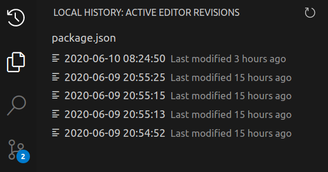

<br />
<div align='center'>


</div>

# Local History


## Description

The **Local History** extension manages revisions of a file independently of source control providers by automatically creating local copies of the file on the user's filesystem. The extension permits users the ability to easily view, track, manage and restore files based on previous saves. The extension is particularly useful for disaster recovery.

---

## Features

The following are some notable features the extension provides:

- ### Automatic Revisions

  The extension **automatically** creates readonly revisions of a file when a save occurs without the need for manual intervention by a user. The revisions are automatically tracked by the extension, and the extension allows users the ability to manage them directly in the application. In addition to a unique timestamp (ex. `20200610135906_973`), a revision’s filename also contains one of the following context metadata: 
  - `m` (revision created due to a manual change in the content of the file)
  - `r` (revision created before a revert was made by the user)

  _Note_: the automatic creation of revisions are based on a number of factors including contributed preferences which control the logic. Please review the [preferences documentation](#preferences) in order to understand how they can affect saving.

- ### Local History Tree View

  The extension contributes a new `tree-view` (sidebar view) to the application which is used to manage, and list all available revisions for the **active text document**.

  The view contributes the following functionality:

  - _list_: the view lists all available revisions for the **active text document**. When the active text document is updated, or new revisions are created/deleted, the view updates accordingly.
  - _diff_: the view allows users to easily view revisions in a `diff` editor which highlights the additions/deletions based on the latest file content. In order to trigger the `diff`, the user can select a revision node in the tree.

  <br />

  <div align='center'>

  

  </div>

  <br />

  - _delete_: the view allows users the possibility to **delete** revisions (trash icon). Performing a **delete** will remove the revision from the filesystem where the extension stores its revisions.

  <br />

  <div align='center'>

  

  </div>

  <br />

  - _revert_: the view allows users the possibility to **revert** (history icon) their latest content to a previous revision. Performing a revert will first create a new revision of the latest document content, and then revert the content to a previous revision.

  <br />

  <div align='center'>

  

  </div>

  <br />


  <div align='center'>

  _Revisions Present_:
  
  

  </div>


  <div align='center'>

  _No Revisions_:
  
  

  </div>


  <div align='center'>

  _No Active Editor_:
  
  

  </div>

- ### View Revisions as a `Diff`

   The extension opens a readonly `diff` editor (lines added versus removed) when viewing a revision for the active editor. This helps users easily view the differences between the revision and the latest editor content.

  <div align='center'>
  
  

  </div>

- ### Revision Management

  The extension contributes the following management actions.\
  The actions include:
  - ability to revert to a previous revision.
  - ability to remove a previous revision.
  - ability to clear all revisions for an active editor.
  - ability to clear all revisions older than a specified number of days for the given workspace.

- ### Simple Storage Structure

  The extension uses a simple storage mechanism, by re-creating the same folder structure as the workspace to store revisions.
  The revisions are stored under the user's home in a directory named `.local-history`. 
  
  For example, if the file `/home/foobar/workspaces/theia/package.json` is modified, it's corresponding storage location will be
  `/home/.local-history/home/foobar/workspaces/theia/package.json/`.
  
  Using a simple storage allows users to easily navigate and find revisions outside of the application when they need to view all previous revisions quickly.

- ### Local History Commands

  The extension contributes [commands](#commands) to the command palette, explorer context menu and the editor context menu. 

---

## Documentation

### Commands

- #### `Local History: View History`

  The command prompts users to select a revision for the active editor given that revisions exist. Upon selecting a revision, a `diff` editor is opened which displays the differences between the revision and the current content of the editor.

- #### `Local History: Clear History`

  The command clears the entire history for the active editor.
  Internally, the command deletes all revisions from the filesystem for the given editor.

- #### `Local History: Clear History (Workspace)`

  The following command clears the history for the provided workspace which are older than a specified **number of days**. The command will prompt users to specify the **number of days**, and in a multiple-root workspace will also prompt for which root to delete from.

- #### `Local History: Copy Revision Path`

  The command copies the revision path for the selected resource to the user's clipboard. 

  Example Resource Revision Path:

  ```
  /home/foobar/.local-history/home/foobar/workspaces/theia/packages/workspace/src/node/default-workspace-server.ts
  ```

- #### `Local History: Copy Revision Path (Workspace)`

  The command copies the **workspace** revision path to the user's clipboard.

  Example Workspace Revision Path:

  ```
  /home/foobar/.local-history/home/foobar/workspaces/theia
  ```

---

### Preferences

- #### `Local-history: Exclude Files`

  The preference configures the `glob patterns` of file paths to exclude from automatic revisions. The preference inherits all the glob patterns from the `files.exclude` setting, and defaults to `**/.local-history/**`.

- #### `Local-history: File Limit`

  The preference controls the maximum number of saved revisions allowed for a given file. The default value is **30** revisions, and can have a minimum value of **5** revisions. If the threshold limit is reached, the oldest revision is deleted in order to save the new backup.

- #### `Local-history: File Size Limit`

  The preference controls the maximum acceptable file size for storing revisions in megabytes. This preference defaults to **5Mb** and can have a minimum value of **0.5Mb**. For file sizes greater than the limit, revisions will **not** be created.

- #### `Local-history: Save Delay`

  The preference controls the save delay in milliseconds. The default value is **300000** milliseconds and can have minimum value of **0** milliseconds.

  The save delay controls saving revisions in the following way:
  - if a user saves the document **within** the save delay, the latest revision is updated with the new content and timestamp.
  - if a user saves the document **after** the save delay, a new revision is made.

---

## Development

- [QuickStart](https://github.com/vince-fugnitto/local-history-ext/blob/master/docs/vsc-extension-quickstart.md)

## License

- [EPL-2.0 OR GPL-2.0 WITH Classpath-exception-2.0](./LICENSE)
